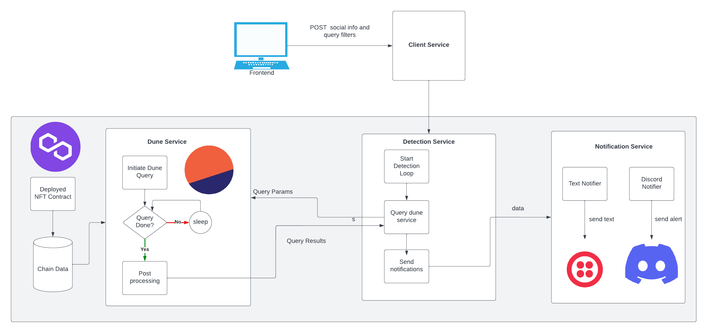

# DrainPipe
DrainPipe is a near real-time alerting system for DAO's and NFT communities. We monitor the chain for
suspicious NFT activity (e.g. a large number of transfers for a collection in a single block) and send
alerts via text and discord. The sooner you know if a wallet is hacked and being drained of its NFTs
the sooner you can
* Report the tokens as stolen to OpenSea to prevent the hacker from cashing out
* Blacklist those tokens from DAO governance or protocol participation until the situation is fully understood
* And much more

We use the dune analytics API to run queries and detect potentially suspicious activity. For the demo we support
1 query: Find the total NFT transfers for collection in recent blocks where the total is over a threshold. The
user provides the collection address and the threshold in the input form.

## System Architecture



## Setup/Requirements
* Python 3.8+

## Run the server endponit

Start the server
```
pip install -r requirements.txt
uvicorn server:app
INFO:     Started server process [3844]
INFO:     Waiting for application startup.
INFO:     Application startup complete.
INFO:     Uvicorn running on http://127.0.0.1:8000 (Press CTRL+C to quit)
```

Send POST to start the service
```
curl -X POST -d @startservice.json -H 'Content-Type: application/json' http://127.0.0.1:8000/initservice
```

Example `startservice.json`
```
{
    "contract_address": "0xa9348471D0c803f0f05fB04E94ae737e1A36F248",
    "channels": {
        "sms": {
            "enable": true,
            "phone_number": "555-555-5555"
        },
        "twitter": {
            "enable": false
        },
        "telegram": {
            "enable": true,
            "phone_number": "555-555-5555"
        }
    }
}
```