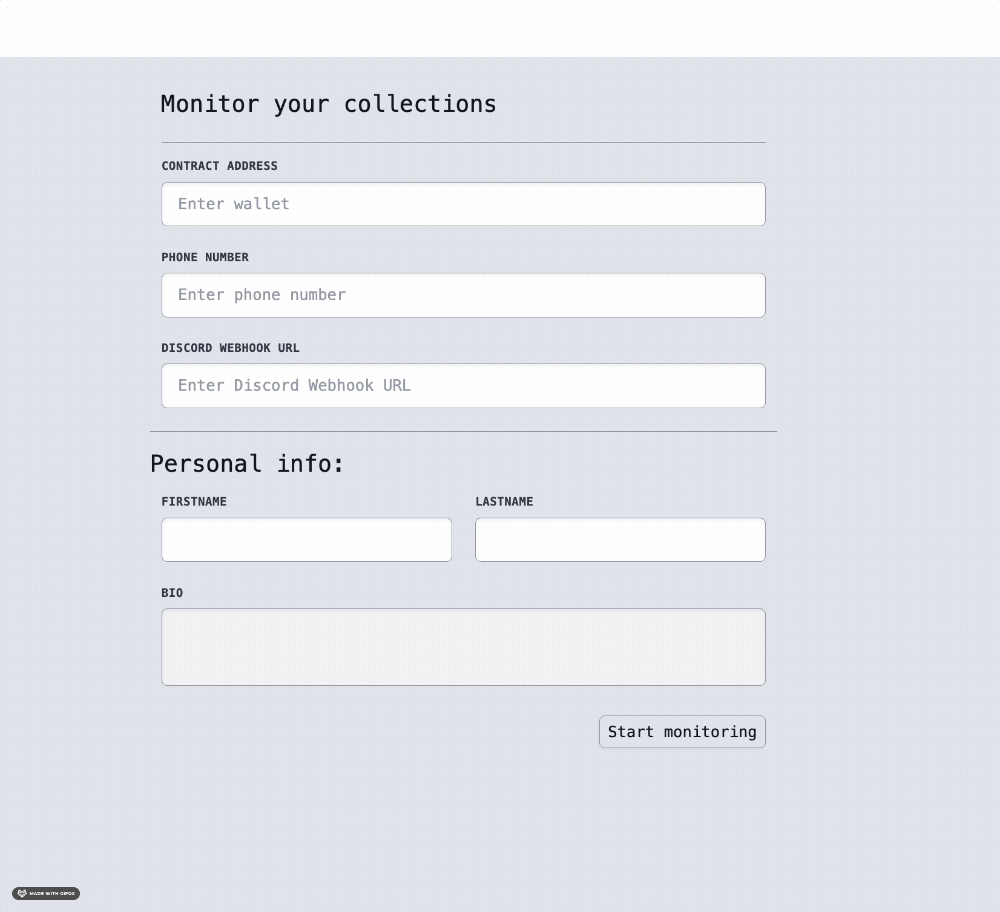

# DrainPipe
DrainPipe is a near real-time alerting system for DAO's and NFT communities. We monitor the chain for
suspicious NFT activity (e.g. a large number of transfers for a collection in a single block) and send
alerts via text and discord. The sooner you know if a wallet is hacked and being drained of its NFTs
the sooner you can TAKE ACTION!

* Report the tokens as stolen to OpenSea to prevent the hacker from cashing out
* Blacklist those tokens from DAO governance or protocol participation until the situation is fully understood
* DAO bot re-buys NFTs with DAO insurance funcs
* DAO buys stolen NFTs and puts in quarantine wallet
* Much, much more ...

We use the dune analytics API to run queries and detect potentially suspicious activity. For the demo we support
1 query: 
```Find the total NFT transfers for collection in recent blocks where the total is over a threshold. The
user provides the collection address and the threshold in the input form.
```
## Drainpipe In ACTION


## System Architecture


## Future Improvements
* Creating more detection rules
    * Use wallet statistics (frequency of TX, size of TX, contracts interacted with, etc.)
    * Use collection statistics
        * Other concurrent transactions from holders could indicate staking going live or a similar event.
    * Use listing data
        * Large transfers followed by listings well under Floor Price is obviously a drain
* Adding more notification channels
* Making detection closer to real-time

# Installation
## Setup/Requirements
* python 3.8+
* yarn v1.22+
### Credentials

`./api_keys.json`

```
{
    "twilio_sid": "ABCDEFG",
    "twilio_auth_token": "ABCDEFG",
    "twilio_phone_number": "+15555555555",
    "dune_api_key": "ABCDEFG",
    "alchemy_polygon_url": "https://polygon-mainnet.g.alchemy.com/v2/YOURALCHEMYCODE",
    "discord_webhook_url": "https://discord.com/api/webhooks/YOURSERVERWEBHOOK"
}
```
## Run the backend server endponit

Start Backend Service
```
pip install -r requirements.txt
uvicorn server:app
INFO:     Started server process [3844]
INFO:     Waiting for application startup.
INFO:     Application startup complete.
INFO:     Uvicorn running on http://127.0.0.1:8000 (Press CTRL+C to quit)
```

Example POST to start the service
```
curl -X POST -d @startservice.json -H 'Content-Type: application/json' http://127.0.0.1:8000/initservice
```

Example `startservice.json` Some values are obviously for example only. Use a valid phone number and discord_webhook_url. This is the `JSON` that is send from the frontend client to start the drainpipe service.
```
{
    "contract_address": "0xe1e5d4A11592D46E349A2d3FF2817f063532c538",
    "collection_name": "ETHSF2022",
    "channels": {
        "sms": {
            "enable": true,
            "phone_number": "555-555-5555"
        },
        "twitter": {
            "enable": false
        },
        "telegram": {
            "enable": true,
            "phone_number": "555-555-5555"
        },
        "discord": {
            "enable": true,
            "discord_webhook_url": "https://discord.com/api/webhooks/YOURSERVERWEBHOOK",
            "server_name": "drainpipe"
        }
    }
}
```